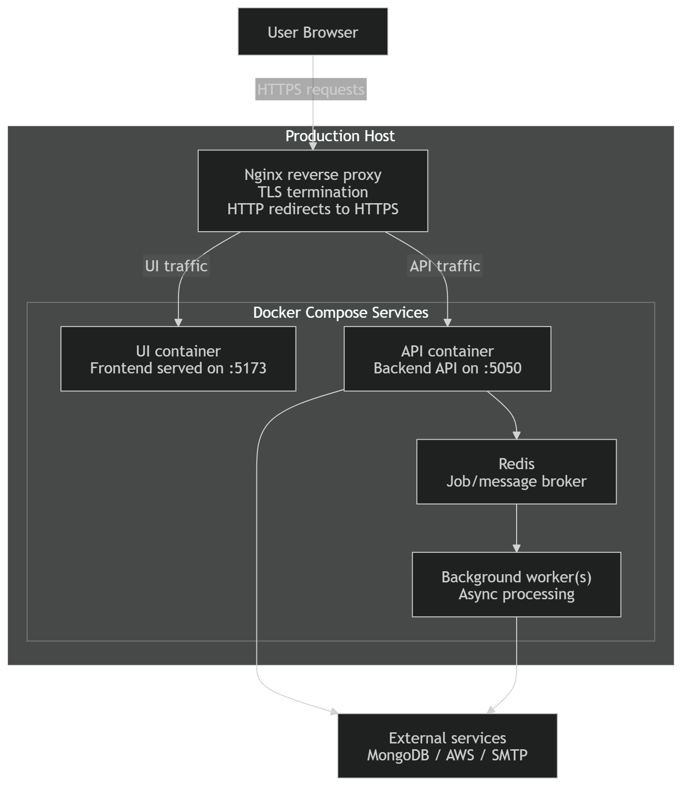

# Production Deployment

This folder contains the production deployment assets for CloudShield. The production setup uses `systemd` to start the Docker Compose stack, `nginx` to terminate HTTPS and reverse proxy traffic, and a small set of containers for the UI, API, background workers, Redis, and Elasticsearch.

## How It Works

Incoming traffic first reaches host-level `nginx`, which handles TLS and forwards requests to the correct local service:

- `real.encs.concordia.ca` -> UI container on `127.0.0.1:5173`
- `api.real.encs.concordia.ca` -> API container on `127.0.0.1:5050`

`systemd` manages the production stack using the service files in [`systemd/`](./systemd):

- `api-test.service` starts the backend stack: `redis`, `elasticsearch`, `api-test`, `api-worker`, and `workstations-worker`
- `ui.service` starts the UI container and depends on the API stack being up

The API serves requests from the web interface, stores application data in MongoDB, and pushes long-running jobs into Redis queues. Background workers then pick up those jobs to handle provisioning, workstation lifecycle actions, infrastructure tasks, and email-related work.

## Files In This Folder

- [`deploy-production.sh`](./deploy-production.sh): pulls the latest production branch, ensures Docker networks and host mount paths exist, builds images, starts the stack, and runs health checks
- [`nginx/cloudshield.conf`](./nginx/cloudshield.conf): production reverse proxy and TLS configuration
- [`systemd/api-test.service`](./systemd/api-test.service): backend stack unit
- [`systemd/ui.service`](./systemd/ui.service): UI unit

## Uptime Monitoring

CloudShield also has an uptime monitoring page that checks whether production services are reachable and running:

- https://cloudshield-status.duckdns.org/status/production

This gives a quick external view of platform availability on top of the built-in container and health-check flow used during deployment.
